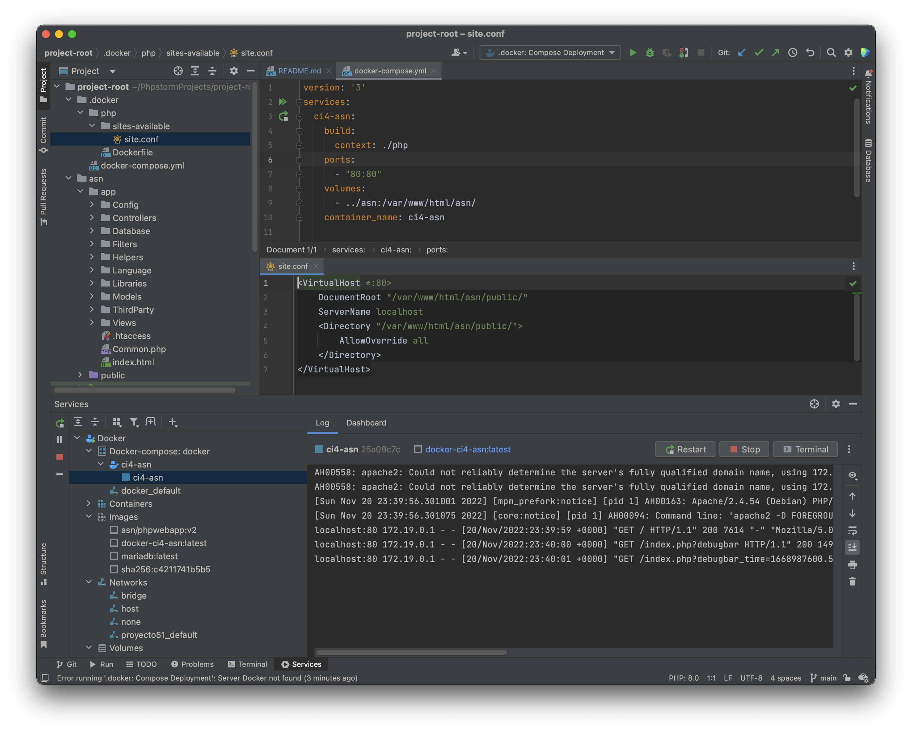
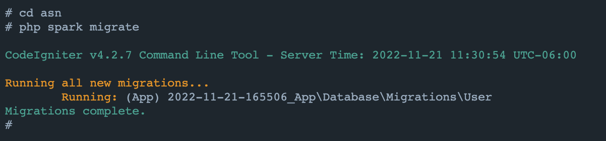
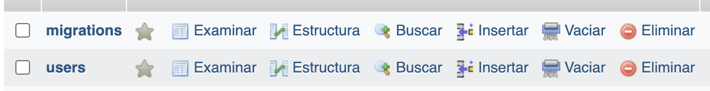

ASN
===

# Desarrollo

Para levantar el servidor ejecuta `docker-compose up -d`, se levantará el servicio en la
url [localhost](http://localhost:80)



---

A continuación, al desplegar la web podemos ver las 3 secciones, pero antes de ello debemos realizar la migración de la base de datos.

Para ello debemos introducirnos en la consola de la instancia desde docker y realizar la migración con el siguiente comando.

He configurado el despligue de forma que no sea necesario instalar nada y ya tenga todas las dependecias necesarias.

```bash
cd asn
php spark migrate
```



Podemos observar que se han creado dos tablas, una con los usuarios y otra con las migraciones que realizamos con php y codeigniter 4.




```
➜  project-root/asn/app git:(main) ✗ tree Models
Models
├── Example_1Model.php
├── Example_2Model.php
├── Example_3Model.php
└── UserModel.php

0 directories, 4 files
```

```
➜  project-root/asn/app git:(main) ✗ tree Views
Views
├── Auth
├── errors
│   ├── cli
│   └── html
├── index.php
├── modals
├── pages
│   ├── example1_insecure.php
│   ├── example1_secure.php
│   ├── example2_insecure.php
│   ├── example2_secure.php
│   ├── example3_insecure.php
│   ├── example3_secure.php
│   └── index.php
├── template
│   ├── debug.php
│   ├── footer.php
│   ├── header.php
│   ├── layout.php
│   └── notifications.php
└── welcome_message.php

7 directories, 22 files
```

```
➜  project-root/asn/app git:(main) ✗ tree Controllers
Controllers
├── BaseController.php
├── Example_1.php
├── Example_2.php
├── Example_3.php
└── Home.php

0 directories, 5 files
```

--- 

Estos son ejemplos de control, validación y protección muy básicos, para proteger una aplicación real deberiamos usar muchos más métodos y medidas de control con reglas más complejas y completas, pero para este ejemplo es más que suficiente como una prueba de concepto para proteger una aplicación frente ataques.

---

## Ejemplo 1

Para el ejemplo 1 inseguro se nos exige que el titulo y el mensaje a introducir debe tener una longitud de 5 y 10 caracteres correspondientemente.

Hemos usado los métodos que nos propociona codeigniter, puede revisar el código en 'App/Controllers/Example_1'.


```php
$rules = [
    'title'     => 'required|min_length[5]',
    'message'   => 'required|min_length[10]',
];

if ($this->validate($rules)) {
    $formModel->save([
        'title'     => $this->request->getVar('title'),
        'message'   => $this->request->getVar('message'),
    ]);
    return redirect()->route('Example_1::secure');
}
$data["validation"] = $this->validator;
 ```

---

## Ejemplo 2

Para el ejemplo 2 inseguro hemos hecho una inyección sql muy simple, en el campo de 'mensaje' hemos introducido el siguinte script de javascript

En el ejemplo seguro hemos usado los métodos que nos propociona codeigniter, mientras que en el ejemplo 2 hemos usado una conexión propia con la base de datos usando las variables de entorno y realizando consultas e inserciones sin sanear los datos de los formularios, puede revisar el código en 'App/Controllers/Example_2'

```js
<script>console.log("hack")</script>
 ```

---

## Ejemplo 3

Para desactivar el CSRF Protection en el ejemplo 3 debemos ir a 'App/Config/Filters' y añadimos la siguiente excepción:

```php
<?php

namespace Config;

use CodeIgniter\Config\BaseConfig;

class Filters extends BaseConfig
{
    public $globals = [
        'before' => [
            'csrf' => ['except' => ['Example_3/insecure']],
        ],
    ];
 
    // ...
}
```